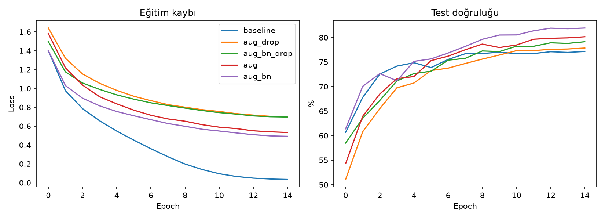
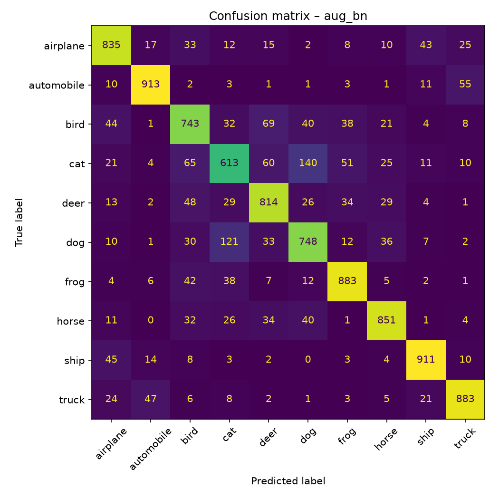

# CIFAR-10 CNN Image Classifier

PyTorch ile CIFAR-10 üzerinde küçük bir CNN eğitip üç farklı ayarı karşılaştıran proje:
veri artırma (augmentation), BatchNorm ve Dropout'un doğruluğa etkisi.

## Kurulum ve çalıştırma
```bash
pip install -r requirements.txt
./run_all.sh          # 3 deneyi eğitir, grafik ve tabloyu üretir
```
Tek bir deney için: `python src/train.py --name aug --augment`

## Sonuçlar
> `python src/evaluate.py` çıktısındaki tabloyu buraya yapıştır.

| Deney | Augment | BatchNorm | Dropout | En iyi doğruluk |
|---|---|---|---|---|
| baseline | False | False | 0.0 | 77.15% |
| aug_drop | True | False | 0.3 | 77.86% |
| aug_bn_drop | True | True | 0.3 | 79.14% |
| aug | True | False | 0.0 | 80.16% |
| aug_bn | True | True | 0.0 | 81.94% |





## Yorum
Beş ayar karşılaştırıldı (ablation). Veri artırma (RandomCrop + yatay çevirme) test doğruluğunu %77.15'ten %80.16'ya çıkardı (+3.01 puan). BatchNorm eklenmesi iki karşılaştırmada da fayda sağladı ve en iyi sonucu veren aug_bn modeline ulaştı: %81.94. Dropout (0.3) ise her kombinasyonda doğruluğu 2-3 puan düşürdü; model küçük ve eğitim 15 epoch ile kısıtlı olduğu için Dropout'un düzenleme faydası yerine eğitimi yavaşlatan etkisi öne çıkmış olabilir. [Eğrilerde ... gözlendi: örneğin eğitim kaybı ile test doğruluğu arasındaki fark, overfitting var mı?] En çok karışan sınıflar [confusion matrix'e göre, örn. cat–dog] oldu. Tüm deneyler tek seed ile çalıştırıldı; sonuçlar yön olarak tutarlı olsa da kesinleştirmek için çoklu seed ile tekrar gerekir.

## Proje yapısı
- `src/data.py` – veri yükleme ve augmentation
- `src/model.py` – CNN mimarisi
- `src/train.py` – eğitim döngüsü, cosine LR scheduler, en iyi modeli kaydetme
- `src/evaluate.py` – karşılaştırma tablosu, eğri grafiği, confusion matrix
